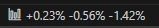
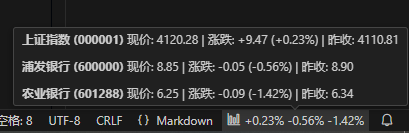
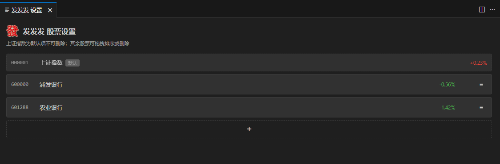

# 发发发

vscode下方状态栏右侧很隐秘的实时显示自选A股涨跌幅。







## 功能特性

- **状态栏涨跌幅**：在编辑器右下角显示所选股票的涨跌幅，红涨绿跌
- **默认上证指数**：安装后自动跟踪上证指数（`000001`），固定首位，不可删除或拖动
- **自定义股票列表**：支持添加、删除、拖拽排序任意 A 股
- **自动刷新**：工作日 9:15–15:05 交易时段内每 3 秒更新行情
- **一键显隐**：可隐藏状态栏股票栏，需要时再显示
- **悬停详情**：鼠标悬停状态栏可查看股票名称、现价、涨跌额与昨收

## 安装

### 从 Release 下载（推荐）

1. 打开 [Releases 页面](https://github.com/darge-0315/fafafa-vscode/releases)
2. 选择目标版本，下载 `fafafa-x.x.x.vsix`
3. 将.vsix文件拖入 VS Code / Cursor 扩展中自动安装

### 从源码打包

```powershell
git clone https://github.com/darge-0315/fafafa-vscode.git
cd fafafa-vscode
npm install
npm run package
```

打包完成后，项目根目录会生成 `fafafa-x.x.x.vsix`，按上述步骤 3–4 安装即可。

**环境要求**：Node.js 18 及以上。

## 使用指南

### 状态栏

扩展激活后，状态栏右侧会出现「发发发」条目，显示当前股票涨跌幅，例如：

```
+0.12% +1.35%
```

点击状态栏条目，可打开快捷菜单：

- **隐藏 / 显示股票栏**：切换状态栏中的涨跌幅显示
- **打开设置**：管理股票列表

### 命令面板

按 `Ctrl+Shift+P`（macOS：`Cmd+Shift+P`），输入 `发发发` 可使用：

| 命令 | 说明 |
|------|------|
| `发发发: 打开设置` | 打开股票管理页面 |
| `发发发: 菜单` | 打开快捷菜单 |
| `发发发: 切换显示` | 切换状态栏显隐 |

### 设置页

在设置页中可以：

- 查看各股票的代码、名称与实时涨跌幅
- 点击 `+` 添加 6 位 A 股代码
- 拖拽右侧 `≡` 把手调整非默认股票的顺序
- 点击 `−` 删除非默认股票

**说明**：上证指数为默认项，带有「默认」标记，不可删除或拖动，始终位于列表第一位。

## 股票代码说明

输入 **6 位数字** A 股代码即可，例如：

| 代码 | 说明 |
|------|------|
| `000001` | 上证指数（默认固定） |
| `600000` | 浦发银行（沪市） |
| `000002` | 万科 A（深市） |
| `300750` | 宁德时代（创业板） |

沪市股票通常以 `600`、`601`、`603`、`688` 开头；深市以 `000`、`001`、`002`、`003`、`300` 开头。

> 本插件中 `000001` 专指上证指数，与深圳个股平安银行（同为 `000001`）不同，请勿混淆。

## 数据来源

行情数据来自 [腾讯财经 API](https://qt.gtimg.cn/)，只读公开行情，无需注册或登录。
